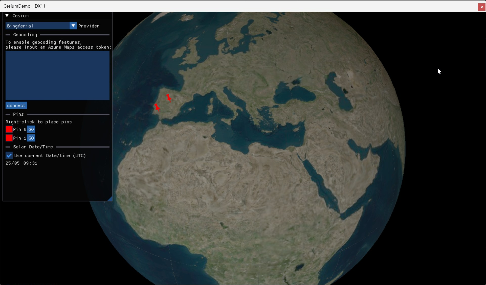
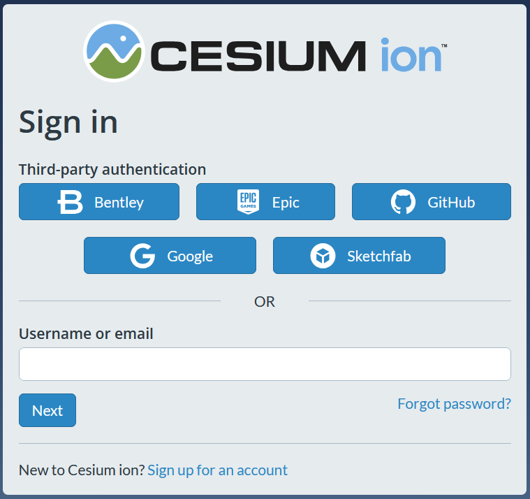
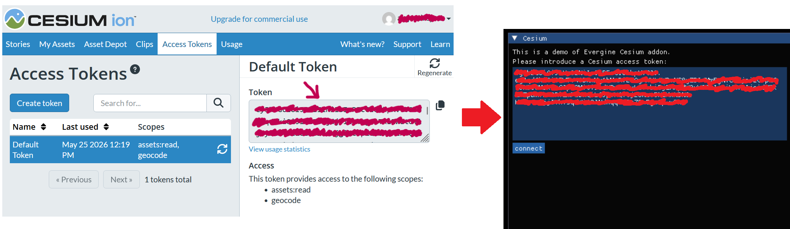
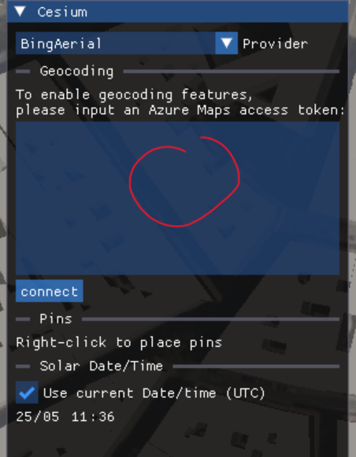

# CesiumDemo

## Introduction

This Evergine sample demostrates how to use the Cesium addon.

## Build and Test

Just open the Visual Studio Windows solution and start debugging the project.

## Obtain Cesium API token

In order for the application to access the Cesium resources, you will need to obtain a Cesium API access token. \
You can obtain a free access token for testing purposes from https://ion.cesium.com. \
Create an account:

Then copy and paste the access token into the welcome panel of the demo:

## Obtain Azure Maps API token

Optionally, if you want to be able to use geocoding capabilities, you will need to obtain an access token for Azure Maps access token. \
You can obtain a free access token for evaluation purposes from https://azure.microsoft.com. \
Then copy the access token here: \

----
Powered by **[Evergine](http://www.evergine.com)**

LET'S CONNECT!

- [Youtube](https://www.youtube.com/subscription_center?add_user=EvergineChannel)
- [Twitter](https://twitter.com/EvergineTeam)
- [Blog](http://geeks.ms/evergineteam/)
